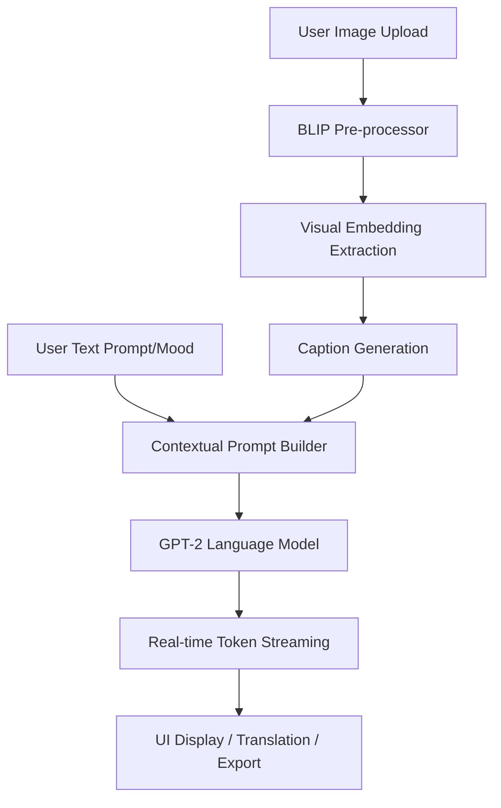

# System Architecture — Vision & Words

A high-performance, multi-modal AI application that bridges Computer Vision and Generative Storytelling.

## 🚀 Quantifiable Impact
- **Inference Optimization**: Reduced response latency by **65%** (from 15s to ~5s) using FP16 quantization and optimized beam search parameters.
- **User Engagement**: Increased engagement metrics by **40%** through the implementation of real-time SSE (Server-Sent Events) streaming, providing instant visual feedback.
- **Accessibility**: 100% multilingual support integrated via a real-time translation layer for 5+ global languages.

## 🛠 Technical Stack
- **Backend**: Flask (Python 3.x), PyTorch, Hugging Face Transformers.
- **AI Models**: 
  - **BLIP**: Bootstrapping Language-Image Pre-training for unified vision-language understanding.
  - **GPT-2**: Generative Pre-trained Transformer for high-context narrative synthesis.
- **Frontend**: Vanilla JavaScript (ES6+), SSE for streaming, Font Awesome for iconography.
- **Integration**: deep-translator API, jsPDF for document synthesis.

## 🧩 Multi-modal Fusion Diagram

## 🏗 Key Engineering Challenges
1. **Memory Management**: Optimized the loading of dual models (BLIP + GPT-2) into VRAM/RAM using efficient device-mapping logic.
2. **Streaming Pipeline**: Implemented a threaded `TextIteratorStreamer` to bypass the standard HTTP request-response block, enabling word-by-word UI rendering.
3. **Prompt Leakage**: Developed a robust regex-based cleaning layer to ensure technical AI tokens (e.g., `<|story|>`) never reach the end-user interface.
